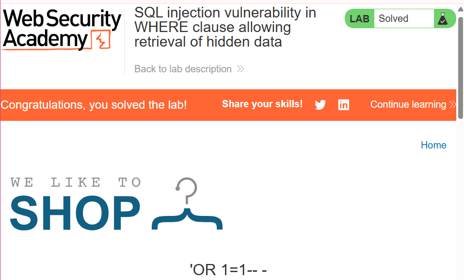

# SQLi Vulnerability

SQL injection is a vulnerability that allows an attacker to interfere with the queries that an application makes to its database. Attackers insert malicious SQL statements into input fields to manipulate backend databases. This can allow an attacker to view data that they might not be authorised to see/retrieve. A successful exploit can allow attackers to read sensitive data from the database, modify database data (INSERT/UPDATE/DELETE), execute administrative operations on the database (shut down the database management system), recover the content of a given file that is present on the database and in some instances issue command to the operating system (Remote Code Execution). 

A successful SQL injection attack can result in unauthorized access to sensitive data, such as:

- Passwords.
- Credit card details.
- Personal user information.

### Lab 1:  [](https://portswigger.net/web-security/sql-injection/lab-retrieve-hidden-data)**SQL injection vulnerability in WHERE clause allowing retrieval of hidden data**

The SQLi vulnerability can be found in the product category filter. When the user selects a category, the application carries out a SQL query like the following:

```sql
SELECT * FROM products WHERE category = 'Gifts' AND released = 1
```

*→ GOAL: DISPLAY ONE OR MORE UNRELEASED ITEMS*

In order to exploit the vulnerability we need to use the following payload:  → **‘OR 1=1- -  -**

*Why this payload works and what it is doing:*

- The single quote (`'`) closes the opening quote in the SQL query, effectively closing the category string.
- `or 1=1` is always true in SQL. So, this part of the query essentially says, "Give me all the gifts where the gift is anything or where 1 is equal to 1," which is always true. **(a=randomdata or 1=1) ==> TRUE**
- OR means the entire WHERE clause evaluates to true for **every row**
- The double hyphens (`-`) are used to comment out the rest of the query, ensuring that the injected code doesn't break the original query structure.

After injecting the payload the new query looks like this: 

```sql
SELECT * FROM products WHERE category = 'Gifts' OR 1=1-- - AND released = 1
```

LAB SOLVED:



### Lab 2:  [](https://portswigger.net/web-security/sql-injection/lab-retrieve-hidden-data)**SQL injection vulnerability allowing login bypass**

The SQLi vulnerability can be found in the login function of this website, specifically the “Username” field. 

When a user submits a username and password, the following query is performed:

```sql
SELECT * FROM users WHERE username = 'tegrezy' AND password = 'blahhh'
```

If the credentials are correct, the login is successful otherwise it is rejected. In order to exploit this vulnerability, we can use the SQL comment sequence to remove the password check from the WHERE clause of the query. 


*→ GOAL: LOGIN AS AN ADMINISTRATOR*

In order to exploit this vulnerability we submit the following payload **`administrator'--`**

Followed by no/or any password. Which results in the following query:

```sql
users WHERE username = 'administrator'--' AND password = 'm'
```

This query returns the user whose **`username`** is **`administrator`** and successfully logs the attacker in as that user.


## UNION ATTACKS

Union-based SQL injection involves the use of the UNION operator that combines the results of multiple SELECT statements to fetch data from multiple tables as a single result set. 

Example:

```sql
SELECT a, b FROM table1 UNION SELECT c, d FROM table2
```

This SQL query returns a single result set with two columns, containing values from columns `a` and `b` in `table1` and columns `c` and `d` in `table2`

The malicious UNION operator query can be sent to the database via website **URL** or user input field.

### Lab 3: **SQL injection UNION attack, determining the number of columns returned by the query**