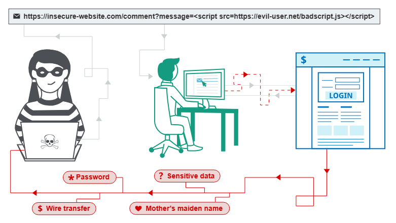
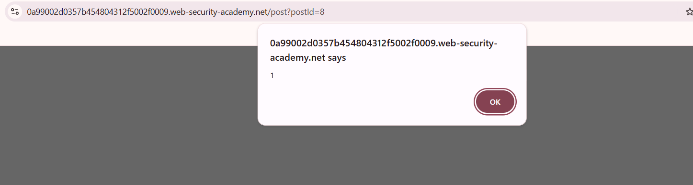

# Cross-Site Scripting (XSS) Vulnerability

# What is Cross-Site Scripting?

 Cross-site scripting (also known as XSS) is a web security vulnerability that allows an attacker to compromise the interactions that users have with a vulnerable application. It allows an attacker to bypass the same origin policy, which is designed to isolate different websites from each other. Cross-site scripting vulnerabilities normally allow an attacker to masquerade as a victim user, to carry out any actions that the user is able to perform, and to access any of the user's data. If the victim user has privileged access within the application, then the attacker might be able to gain full control over all of the application's functionality and data. 

<aside>
💡

**Same Origin Policy (SOP):** 
A web page loaded from one site **cannot read or modify data** on a web page loaded from another site. 

If Site A and Site B have different origins, Site A **cannot**:

- Read cookies, local storage, or tokens belonging to Site B.
- Access the DOM (page structure/content) of Site B inside an `<iframe>` or pop-up window.

Read response data from background requests (AJAX/Fetch) made to Site B.

</aside>

# How does it work?

Cross-site scripting works by manipulating a vulnerable web site so that it returns malicious JavaScript to users. When the malicious code executes inside a victim's browser, the attacker can fully compromise their interaction with the application. 



# Types Of XSS?

## Reflected Cross-Site Scripting?

Reflected XSS is the simplest variety of cross-site scripting. It arises when an application receives data in an HTTP request and includes that data within the immediate response in an unsafe way. Malicious input is reflected back to the user in the response.

**Lab 1: Reflected XSS into HTML context with nothing encoded**

A Reflected XSS vulnerability is discovered in the search function of this web application, it executes malicious Javascript. We are able to exploit this vulnerability by triggering the alert function with the following payload:

```jsx
<script>alert(1)</script>
```


As seen, the search function executes the alert and reflects back the (1) we included in the payload.

### Impact Of Reflected XSS

An attacker can:

- Perform any action within the application that the user can perform.
- View any information that the user is able to view.
- Modify any information that the user is able to modify.
- Initiate interactions with other application users, including malicious attacks, that will appear to originate from the initial victim user.

## Stored Cross-Site Scripting

Stored cross-site scripting (also known as second-order or 
persistent XSS) arises when an application receives data from an 
untrusted source and includes that data within its later HTTP responses 
in an unsafe way.

Suppose a website allows users to submit comments on blog 
posts, which are displayed to other users. Users submit comments using 
an HTTP request like the following:

```
POST /post/comment HTTP/1.1
Host: vulnerable-website.com
Content-Length: 100

postId=3&comment=This+post+was+extremely+helpful.&name=Carlos+Montoya&email=carlos%40normal-user.net
```

After this comment has been submitted, any user who visits 
the blog post will receive the following within the application's 
response:

```html
<p>This post was extremely helpful.</p>
```

Assuming the application doesn't perform any other 
processing of the data, an attacker can submit a malicious comment like 
this:

```jsx
<script>/* Bad stuff here... */</script>
```

Within the attacker's request, this comment would be URL-encoded as:

```
comment=%3Cscript%3E%2F*%2BBad%2Bstuff%2Bhere...%2B*%2F%3C%2Fscript%3E
```

Any user who visits the blog post will now receive the following within the application's response:

```jsx
<p><script>/* Bad stuff here... */</script></p>
```

The script supplied by the attacker will then execute in the
 victim user's browser, in the context of their session with the 
application.

**Lab 2: Stored XSS into HTML context with nothing encoded**

A Stored XSS vulnerability is identified in the comment field on this web application. The application directly concatenates user input into the HTML body and stores it on the database by the server. So if an attacker wanted to supply arbitrary Javascript in the comment section and post it, it would persist and execute every time a user wanted to view the blog post the comment is posted under. 

How this happens is that when a user makes a rquest for the affected resource, the server queries the database for the webpage content and takes the arbitrary javascript and pastes it directly into the html body. The server then send the HTML document to the user’s browser and then it executes the payload when it renders the webpage.

In order to exploit this vulnerability and call on the alert function, the following payload was used. 

```jsx
<script>alert(1)</script>
```


There are four input fields however the vulnerability was identified in the comment section.


As displayed in the image raw user input is directly conactenated into the HTML body and without safely encoding it. 

 So when we commented arbitrary Javascript the script was included into the HTML context and stored in the database.

```html
 </section>
                    <section class="comment">
                        <p>
                                                    <a id="author" href="https://attacker.com">cyberflair</a> | 05 August 2026
                        </p>
                        <p><script>alert(1)</script></p>
                        <p></p>
                    </section>
```



Now any time a user wants to view the page/post an alert box pops up. 


### Impact of Stored XSS

If an attacker can control a script that is executed in the victim's browser, then they can typically fully compromise that user. A stored XSS vulnerability enables attacks that are self-contained within the application itself. The attacker does not need to find an external way of inducing other users to make a particular request containing their exploit. Rather, the attacker places their exploit into the application itself and simply waits for users to encounter it.

## DOM-based XSS